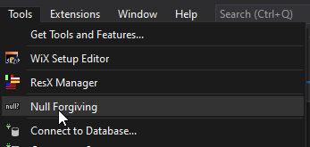
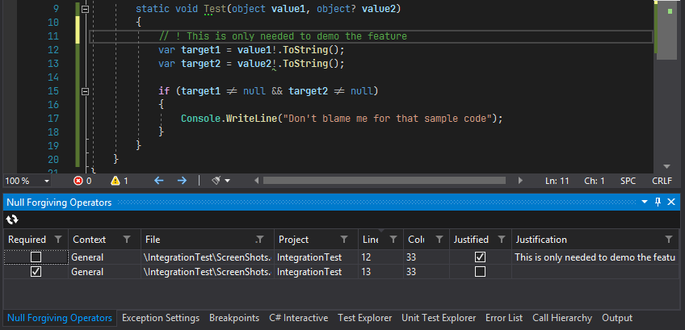

# Nullable Extended
[](https://dev.azure.com/tom-englert/Open%20Source/_build/latest?definitionId=39&repoName=tom-englert%2FNullable.Extended&branchName=AddExtension)
[](https://www.nuget.org/packages/Nullable.Extended.Analyzer/)

## Roslyn Tools and Analyzers to improve the experience when coding with Nullable Reference Types.

[Nullable reference types](https://docs.microsoft.com/en-us/dotnet/csharp/nullable-references) 
are a great feature introduced with C# 8.0. It really helps in writing better code.

This project helps to improve the experience when coding with nullable reference types.

### There are two tools available:
- A Visual Studio Extension that analyzes your sources and tracks usage of null forgiving operators: 
  [Managing Null-Forgiving Operators](#managing-null-forgiving-operators)
- A Roslyn analyzer that double-checks nullability warnings and suppresses some false positives:
  [Suppressing False Positives](#suppressing-false-positives)  

---

### Managing Null-Forgiving Operators

Sometimes it is necessary to use the
[null-forgiving operator "!"](https://docs.microsoft.com/en-us/dotnet/csharp/language-reference/operators/null-forgiving)
to suppress a false warning.
However using too many of them will render the value of nullable checks almost useless. 
Also if you have installed the [analyzer](#suppressing-false-positives) to suppress some common false positives, 
some of the null forgiving operators may be obsolete and can be removed.

Since it's hard to find the null forgiving operators in code, 
this Visual Studio Extension lists all occurrences, 
categorizes them, and even detects those that are still present in code but no longer needed.

Occurrences are grouped into three categories, to reflect their different 
contexts:
- General usages of the null-forgiving operator.
- Null-forgiving operator on the `null` or `default` literals.
- Null-forgiving operator inside lambda expressions.

> e.g. general usages can be mostly avoided by cleaning up the code,
while inside lambda expressions they are often unavoidable

#### Installation

Install the extension from the [Visual Studio Marketplace](https://marketplace.visualstudio.com/items?itemName=TomEnglert.NullableExtended) or from the [Releases](../../releases) page.
The latest CI build is available from the [Open VSIX Gallery](https://www.vsixgallery.com/extension/Nullable.Extended.75a92614-c590-4401-b04b-04926c0e21cf)

#### Usage

Start the tool window from the tools menu:



In the tool window you can see all occurrences of the null-forgiving operator in your solution:



- Click the refresh button to scan your solution.
- Double click any entry to navigate to the corresponding source code.
- Click the delete button to remove all null-forgiving operators that are not required.

---

### Suppressing False Positives

After using nullable reference types and the nullable analysis for a while you'll may notice some false positive `CS8602`, `CS8603` or `CS8604` warnings that may be not expected.

E.g. [IDE0031](https://docs.microsoft.com/en-us/dotnet/fundamentals/code-analysis/style-rules/ide0031) will enforce you to use null propagation, 
but this pattern is not fully covered by the flow analysis of the Roslyn nullable analyzer (see e.g. issues [49653](https://github.com/dotnet/roslyn/issues/49653) 
or [48354](https://github.com/dotnet/roslyn/issues/48354)), and you will see a `CS8602` warning:

```c#
public void Method(object? a) 
{
    var b = a?.ToString();

    if (b == null)
        return;

    // If b is not null, a can't be null here, but a CS8602 is shown:
    var c = a.ToString();
}
``` 

The **Nullable Extended Analyzer** addresses these issues by double checking `CS8602`, `CS8603` and `CS8604` warnings.
It leverages the flow analysis of the [Sonar Analyzer](https://github.com/SonarSource/sonar-dotnet) and suppresses the 
warning if flow analysis reports that access is safe.

> This may not cover all cases, but the most ubiquitous.

#### Installation

Simply install the [NuGet Package](https://www.nuget.org/packages/Nullable.Extended.Analyzer/) in your projects.

#### Configuration

You can configure the analyzer by specifying a property named `<NullableExtendedAnalyzer>` in your project file:

```xml
<PropertyGroup>
  ...
  <Nullable>enable</Nullable>
  <WarningsAsErrors>nullable</WarningsAsErrors>
  <NullableExtendedAnalyzer>
    <LogFile>c:\temp\NullableExtendedAnalyzer.$(MSBuildProjectName).log</LogFile>
  </NullableExtendedAnalyzer>
</PropertyGroup>
```

##### Available configuration properties
- `LogFile`: The full path to a file where diagnostic messages will be written to.
- `MaxSteps`: The maximum number of recursive steps in the graph walk (default 5000). 
  Decrease to give up analysis of large methods in favor of speed, 
  increase to analyze even very large methods.
- `DisableSuppressions`: Set to true to (temporarily) disable suppressions.

---


